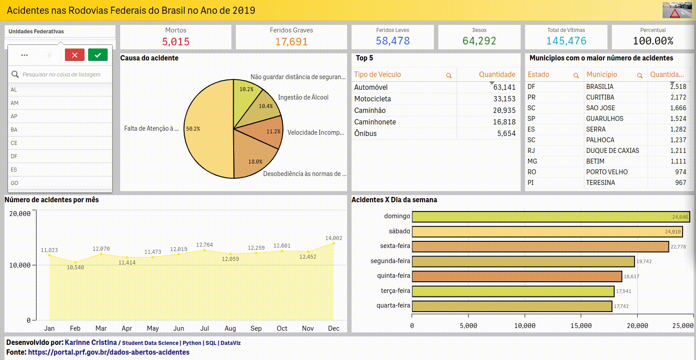

# Análise Sobre os Acidentes nas Rodovias Federais do Brasil no Ano de 2019

**Fonte:** <https://arquivos.prf.gov.br/arquivos/index.php/s/vw74viLA7WuZI4H>

Antes da visualização final foi feita a limpeza e a transformação dos dados usando Pandas e Python, você pode acompanhar o passo a passo no arquivo Analise_Acidentes.ipynb.

O dashboard foi desenvolvido com o **Qlik Sense** e foi personalizado com a ajuda do site <https://sensetheme.com/>.
O Qlik é uma ferramenta de visualização de informações que explora profundamente todos os dados e revela suas conexões de modo simples e instantâneo.

Através dessa análise procurei responder as seguintes questões:

* Quais os dias da semana com o maior número de acidentes? 
* Qual o total de mortos, feridos e ilesos?
* Qual o número de acidentes por mês?
* Quais são os principais motivos dos acidentes nas rodovias?
* Quais os 10 municípios com o maior número de acidentes?
* Quais são os 5 veículos que mais se envolveram em acidentes?

**Observação:** A resposta para essas perguntas podem ser visualizadas a nível de país ou a nível de Estado conforme demonstrado no gif abaixo.

O código é aberto então sinta-se a vontade para colaborar com dicas e sugestões.
